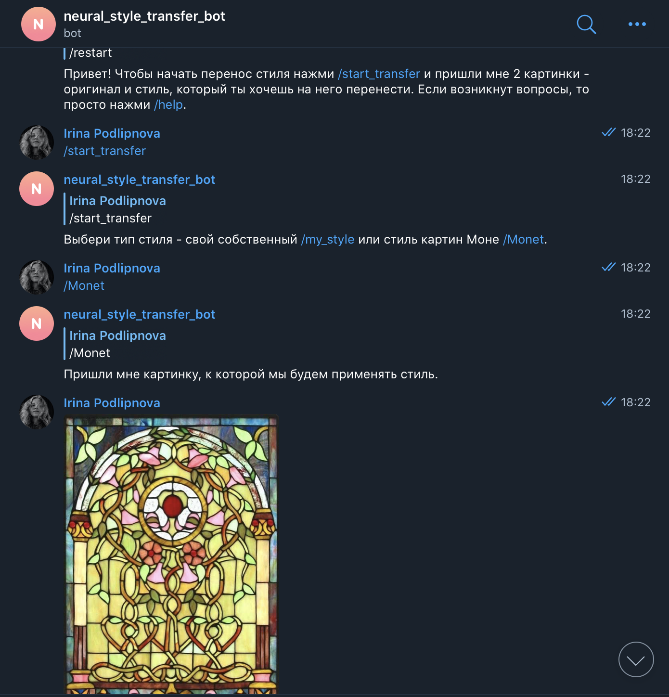
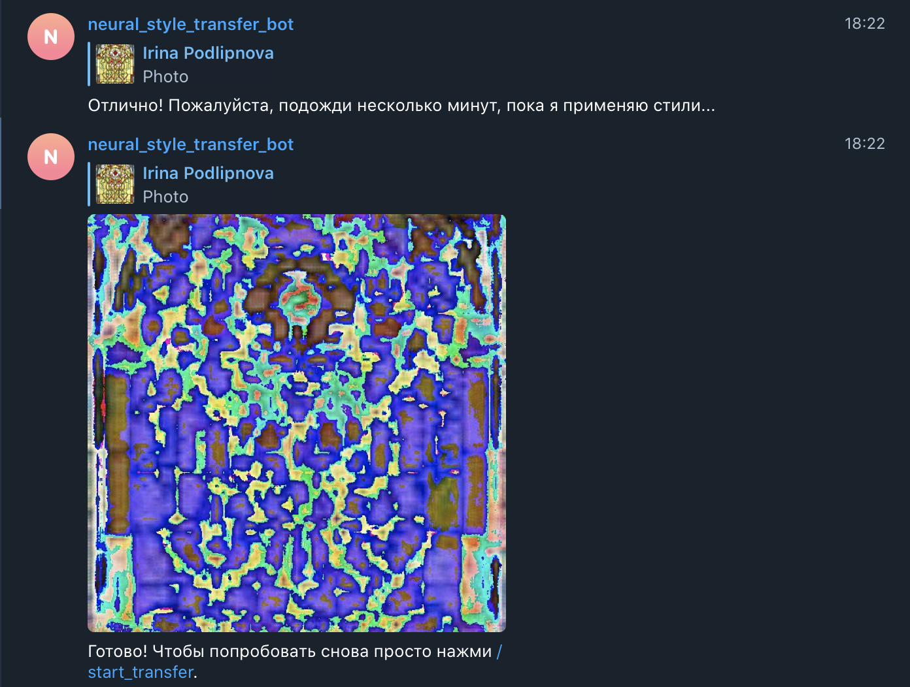
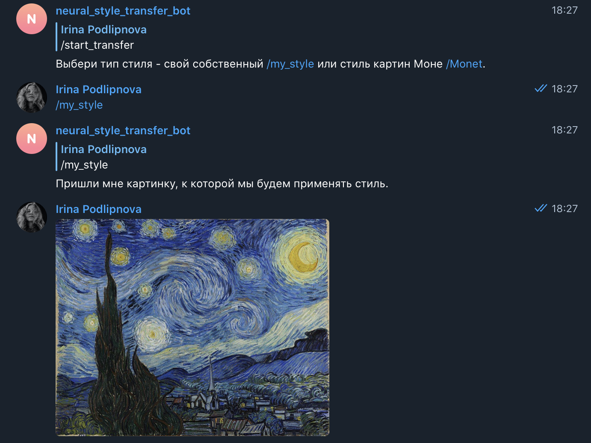
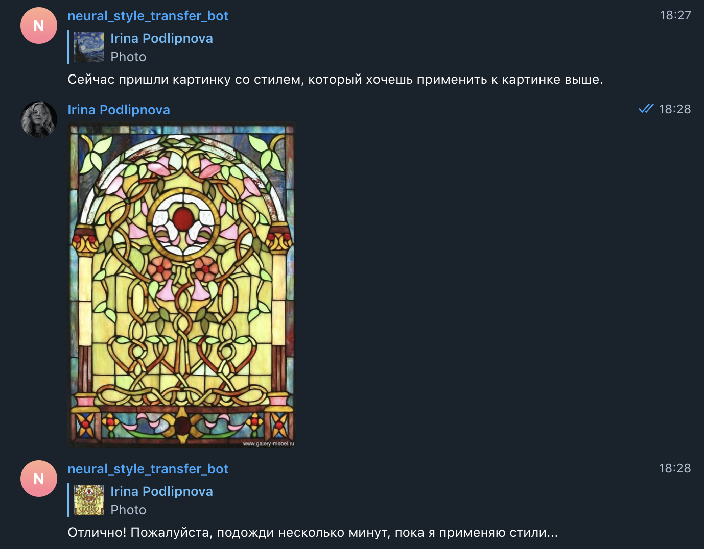
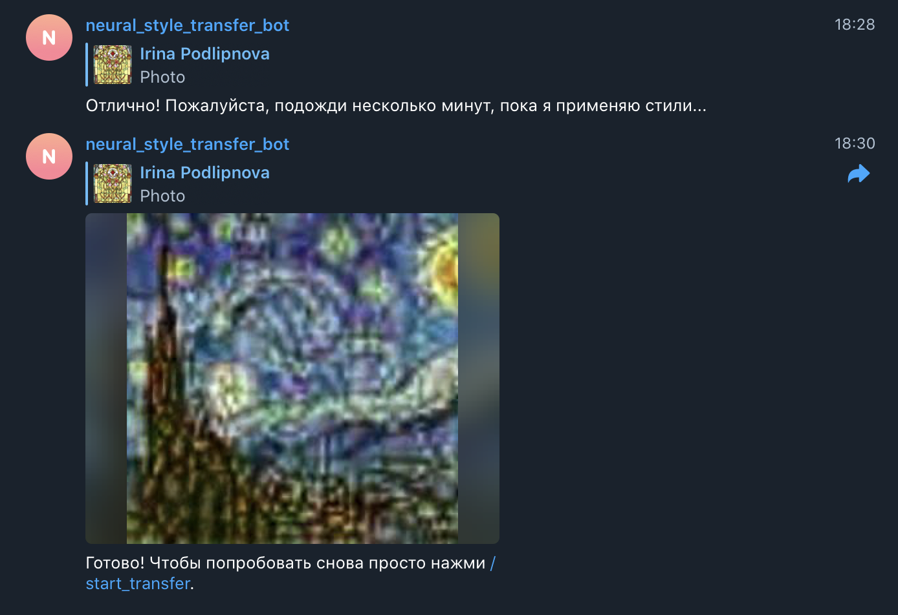

# Telegram bot for style transfer

This repository is a final project of the first semester of Deep Learning School (DLS) course by MIPT.

## Implementation
Neural style transfer model was written based on lectures and seminars examples.
CycleGAN models were used from original implementation from [this repository](https://github.com/junyanz/pytorch-CycleGAN-and-pix2pix/blob/master/models/networks.py).
Training of GAN models take too much time on CPU, so for example of working I used pretrained model for Monet style transfer.

## Usage

You can access bot by Telegram alias @NeuralStyleTransfer_Bot or [url](https://t.me/NeuralStyleTransfer_Bot).
Below are some examples of its work.

Monet pretrained style:



Your own custom style:




## How to launch
Feel free to try the bot. You will see some instructions and hints from the bot while using it.

Here is a docker-compose file to launch it. Just run 
```
docker-compose up --build
```
from the root directory of this project

## Contacts 
My telegram alias is @irinka19_08. Feel free to contact in case of any questions.


